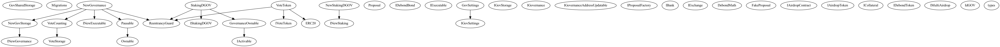
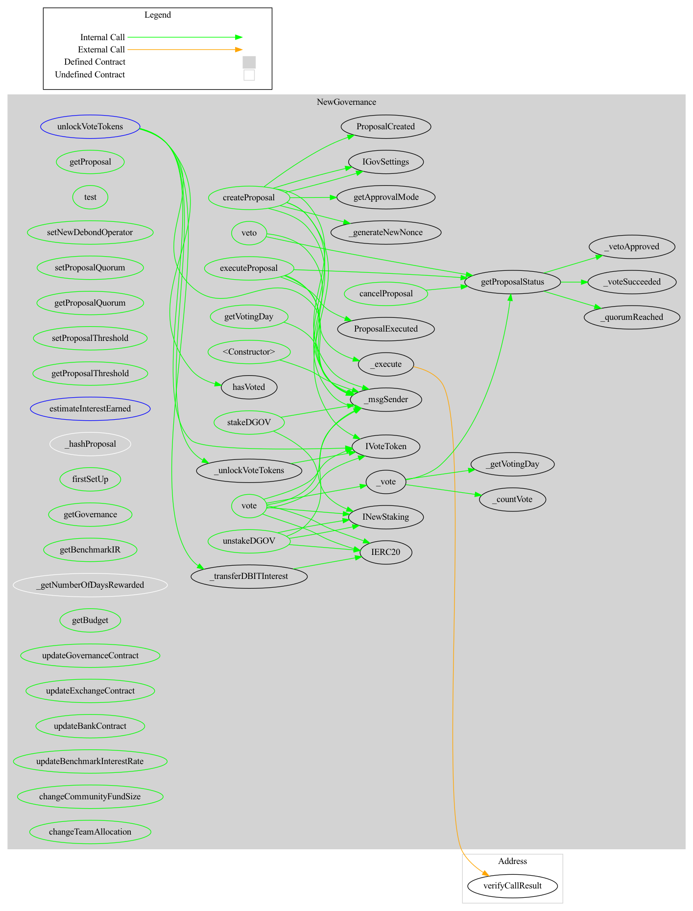

## Debond Governance:

these contracts handle the onchain governance aspects like:

- Upgradation of the protocol parameters (interest rate, staking APY, etc).
- Onboarding the new bond categories by the new whitelisted issuers
- transferring or allocating tokens for different entities in the debond community.
- changing the whole contract (generally by the core debond team only).

The contracts definition are inspired from the[openzeppelin governance](https://github.com/OpenZeppelin/openzeppelin-contracts/tree/master/contracts/governance) which allows transparency of executing the proposal onchain parameters.

Proposal,like the bonds consist of the different classes. based on the category of the bonds, each proposal issued in the given class also has defined properties like: 

- `_proposalQuorum`: the % of minimum vote tokens staked for the given vote type (either for, against/abstain) in order to pass the vote.  

- `_votingPeriod`: It defines the duration (in days) for voting since the issuance of the proposal.

- `numberOfVotingDays`: defines the rewards for the user per day (in % of the supply in DBIT).

It allows DGOV holders to participate in the process by staking their tokens in order to get corresponding vote tokens, which is then can be utilized for the voting, and then recovered after the staking period is removed. 

## Users

There are three counterparties in the governance protocol: 

- Proposer: This can be potential issuer or any participant with the VOTE token that needs to propose the changes in the debond protocol as explained above. they will need to define the parameters of the new paraemters as explain before, and then based on whether the give proposal when its listed is able to pass the vote needed based on the properties defined 


- Voter: this being  Vote holder that stakes his vote token in order to vote, or delegates the votes to other address /protocol (e.g paladin) in order to use the ideal vote. the interest of voter is the interest received in DBIT.

-  Veto address: this is the admin entity from the organization (should be a multisig secure wallet) that will be eventually taking decision about the final execution of the process. even in the case the proposal is passed by majority, this needs final approval from the veto address.


## Contract Description:

There are following main categories of the governance contract:
    - Core governance contract : it consist of the main interface functions for the counterparties in order to interact with the governance logic, these are further divided into following parts 

### Governance.sol

This contract consist of the higher level functions to manage the proposal creation , progress and settlement lifecycle: 

```solidity

interface IGovernance {

    /**
    * @dev store a new proposal onchain
    * @param _class proposal class
    * @param _targets array of contract to interact with if the proposal passes
    * @param _values array contraining ethers to send (can be array of zeros)
    * @param _calldatas array of encoded functions to call if the proposal passes
    * @param _title proposal title
    * @param _descriptionHash proposal description Hash
    */
    function createProposal(
        uint128 _class,
        address[] memory _targets,
        uint256[] memory _values,
        bytes[] memory _calldatas,
        string memory _title,
        bytes32 _descriptionHash
    ) public;


    /** 
    * @dev execute a proposal
    * @param _class proposal class
    * @param _nonce proposal nonce
    */

    function executeProposal(
        uint128 _class,
        uint128 _nonce
    ) public;


    /**
    * @dev cancel a proposal
    * @param _class proposal class
    * @param _nonce proposal nonce
    */

    function cancelProposal(
        uint128 _class,
        uint128 _nonce
    ) public;


    /**
    * @dev vote for a proposal
    * @param _class proposal class
    * @param _nonce proposal nonce
    * @param _tokenOwner owner of staked dgov (can delagate their vote)
    * @param _userVote vote type: 0-FOR, 1-AGAINST, 2-ABSTAIN
    * @param _amountVoteTokens amount of vote tokens
    * @param _stakingCounter counter that returns the rank of staking dGoV
    */
    function vote(
        uint128 _class,
        uint128 _nonce,
        address _tokenOwner,
        uint8 _userVote,
        uint256 _amountVoteTokens,
        uint256 _stakingCounter
    ) public;

    /**
    * @dev veto a proposal
    * @param _class proposal class
    * @param _nonce proposal nonce
    * @param _veto, true if vetoed, false otherwise
    */
    function veto(
        uint128 _class,
        uint128 _nonce,
        bool _veto
    ) public;

}
```

### GovStorage: 

This stores the following details/operations:
    -  structures and mappings to map the storage of the details to the corresponding entity.
    -  along with the parameters to define the staking rewards, voting period, etc.

```solidity


pragma solidity ^0.8.0;

// SPDX-License-Identifier: apache 2.0
/*
    Copyright 2022 Debond Protocol <info@debond.org>
    Licensed under the Apache License, Version 2.0 (the "License");
    you may not use this file except in compliance with the License.
    You may obtain a copy of the License at
    http://www.apache.org/licenses/LICENSE-2.0
    Unless required by applicable law or agreed to in writing, software
    distributed under the License is distributed on an "AS IS" BASIS,
    WITHOUT WARRANTIES OR CONDITIONS OF ANY KIND, either express or implied.
    See the License for the specific language governing permissions and
    limitations under the License.
*/

import "./IGovSharedStorage.sol";

interface IGovStorage is IGovSharedStorage {
    // getter functions
    function isInitialized() external view returns(bool);
    // votes needed (yes/no) if achieved in order to approve/reject from the voters side 
    function getProposalThreshold() external view returns(uint256);
    // get the address (multisig/EOA) that can be 
    function getVetoOperator() external view returns(address);
    // getting addresses from various debond contracts: 
    function getExecutableContract() external view returns(address);
    function getStakingContract() external view returns(address);
    function getVoteTokenContract() external view returns(address);
    function getNumberOfSecondInYear() external pure returns(uint256);
    function getGovernanceAddress() external view returns(address);
    function getExchangeAddress() external view returns(address);
    function getExchangeStorageAddress() external view returns(address);
    function getBankAddress() external view returns(address);
    function getDGOVAddress() external view returns(address);
    function getDBITAddress() external view returns(address);
    function getAPMAddress() external view returns(address);
    function getERC3475Address() external view returns(address);
    function getBankBondManagerAddress() external view returns(address);
    function getBankDataAddress() external view returns(address);
    // Address of the debondTeam that wants to redeem the amount.
    function getDebondTeamAddress() external view returns(address);
    // benchmark interest rate for the rate of interest.
    function getBenchmarkIR() external view returns(uint256);
    // budget of tokens (both DGOV/DBIT) allocated to DebondTeam  (in parts per million).
    function getBudget() external view returns(uint256, uint256);
    // supply from the budget that is already allocated to DebondTeam (in PPM).
    function getAllocationDistributed() external view returns(uint256, uint256);

    function getTotalAllocationDistributed() external view returns(uint256, uint256);
    
    function getAllocatedToken(address _account) external view returns(uint256, uint256);
    function getAllocatedTokenMinted(address _account) external view returns(uint256, uint256);
    
 function getMinimumStakingDuration() external view returns(uint256);
    // function to get the conversion  from DGOV to DBIT for the swaps (using CDP formula).
    function cdpDGOVToDBIT() external view returns(uint256);

    function updateBankAddress(address _bankAddress) external;
    function updateExchangeAddress(address _exchangeAddress) external;
    function updateBankBondManagerAddress(address _bankBondManagerAddress) external;
    function updateGovernanceAddress(address _governanceAddress) external;

    function setStakedData(
        address _staker,
        uint256 _amount,
        uint256 _durationIndex
    ) external returns(uint256 duration, uint256 _amountToMint);

    function getUserStake(
        address _staker,
        uint256 _stakingCounter
    ) external view returns(StackedDGOV memory);

    function updateStake(
        address _staker,
        uint256 _stakingCounter
    ) external returns(uint256 amountDGOV, uint256 amountVote);

    function getStakingData(
        address _staker,
        uint256 _stakingCounter
    ) external view returns(
        uint256 _stakedAmount,
        uint256 startTime,
        uint256 duration,
        uint256 lastWithdrawTime
    );

    function updateLastTimeInterestWithdraw(
        address _staker,
        uint256 _stakingCounter
    ) external;

    function getProposalStruct(
        uint128 _class,
        uint128 _nonce
    ) external view returns(Proposal memory);

    function getClassQuorum(
        uint128 _class
    ) external view returns(uint256);

    function getProposalStatus(
        uint128 _class,
        uint128 _nonce
    ) external view returns(ProposalStatus unassigned);

    function getProposalProposer(
        uint128 _class,
        uint128 _nonce
    ) external view returns(address);

    function getNumberOfVotingDays(
        uint128 _class
    ) external view returns(uint256);

    function getTotalVoteTokenPerDay(
        uint128 _class,
        uint128 _nonce,
        uint256 _votingDay
    ) external view returns(uint256);

    function getVotingPeriod(
        uint128 _class
    ) external view returns(uint256);

    function setProposal(
        uint128 _class,
        address _proposer,
        address[] memory _targets,
        uint256[] memory _values,
        bytes[] memory _calldatas,
        string memory _title,
        bytes32 _descriptionHash
    ) external returns(uint128 nonce);

    function setProposalStatus(
        uint128 _class,
        uint128 _nonce,
        ProposalStatus _status
    ) external returns(Proposal memory);

    function cancel(
        uint128 _class,
        uint128 _nonce,
        address _proposer
    ) external;

    function setVote(
        uint128 _class,
        uint128 _nonce,
        address _voter,
        uint8 _userVote,
        uint256 _amountVoteTokens
    ) external;

    function setVeto(
        uint128 _class,
        uint128 _nonce,
        bool _vetoed
    ) external;

    function hasVoted(
        uint128 _class,
        uint128 _nonce,
        address _account
    ) external view returns(bool voted);

    function hasBeenRewarded(
        uint128 _class,
        uint128 _nonce,
        address _account
    ) external view returns(bool);

    function setUserHasBeenRewarded(
        uint128 _class,
        uint128 _nonce,
        address _account
    ) external;

    function getVoteWeight(
        uint128 _class,
        uint128 _nonce,
        address _account
    ) external view returns(uint256);

    function updateExecutableAddress(
        address _executableAddress
    ) external;

    function setBenchmarkIR(
        uint256 _newBenchmarkInterestRate
    ) external;

    function setProposalThreshold(
        uint256 _newProposalThreshold
    ) external;

    function setFundSize(
        uint256 _newDBITBudgetPPM,
        uint256 _newDGOVBudgetPPM
    ) external returns(bool);

    function setTeamAllocation(
        address _to,
        uint256 _newDBITPPM,
        uint256 _newDGOVPPM
    ) external returns(bool);

    function setAllocatedToken(
        address _token,
        address _to,
        uint256 _amount
    ) external;

    function claimFundForProposal(
        address _to,
        uint256 _amountDBIT,
        uint256 _amountDGOV
    ) external returns(bool);

    function checkSupply(
        address _to,
        uint256 _amountDBIT,
        uint256 _amountDGOV
    ) external view returns(bool);
}


```


### utils: 
1. [ExecutableOwnable](): abstract contract that defines : 

- the modifiers in order to determine the status of contract and functions that are accessible for the executable functions.
- functions to change the executable interface functions.

2. [GovernanceMigrator ](): This stores the function for storing the votes by participant for proposal, along with function to find the sufficient quorum for the functions.


## Working process:

1. Proposal creator (with DGOV tokens) adds all the values for his proposal in the frontend .
    - Proposal contract it inherits only the functions by inheriting from the interface of the governance contract. Example of the contract :[here](./contracts/Proposal/Proposal.sol). Then the Proposal time period starts and then voting starts after the delay period (defined in govSettings by the deployer/ governance) and rests till the `endTime`. 

    ```solidity
    function createProposal(
        uint128 _class,
        address[] memory _targets,
        uint256[] memory _values,
        bytes[] memory _calldatas,
        string memory _description
    )
    ```

2. On the voter side, they stake their tokens in the StakingDGOV contract, which then mints equivalent number of vote tokens for him and puts his DGOV tokens on timelock. Voters are also incentivised by providing them intererst in DBIT once the timelock passes, and their interest depends upon the number of days the user has voted on any proposal. 

3. Once the proposal endtime passes, the frontend checks for the proposal votes (pro,con) and if it satisfies both conditions (pro > con along with the votes being greater than minimum approval votes in the given proposal class). 
    - then we check if veto is required (specially for proposal nonces in class 1 or 2), if yes then veto address will finally determine the fate of proposal status (Accepted/ rejected).
    - else the accepted proposal can be executed by the proposer

4. And then eventually voters can redeem their unused VOTE token back to DGOV, and recovering the DBIT interest.  

## Security Considerations:

- insure that governance veto address (debondOperator) should be secured by multisig as it has override on some parameters and proposals having `noVote` conditions.
- also there is no standardised interface of proposals, thus for the proposals being introduced by the external community members (unless verified) needs to have more scrutiny about the implementation (like having verified contracts and having delay in the proposal execution after voting, etc).

## usage: 

1. For the deployment
    - Add .env private key for the deployment (and defining the `debondOperator`).
    - define the [HDWallet](https://www.npmjs.com/package/@truffle/hdwallet-provider) in the core repo.
    - then run
    ```bash
     $ truffle deploy --network .
    - then define the address of the governance contracts in each of the other contracts (from utils/governanceOwnable.sol).

    ```
2. for importing the smart contracts package:
    ```solidity
    // for defining the proposal smart contract.
    import "debond-governance/contracts/INewExecutable.sol";
    import "debond-governance/contracts/utils/IGovernanceOwnable.sol";
    import "debond-governance/contracts/interfaces/INewGovernance.sol";
    contract testProposal {
    //... see example implementation in Proposal/Proposal.sol.
    
    }
    }

    }
    ```


## Contracts dependence diagram:
### 1. inheritance diagram: 




###  2. NewGovernance function call diagram: 




